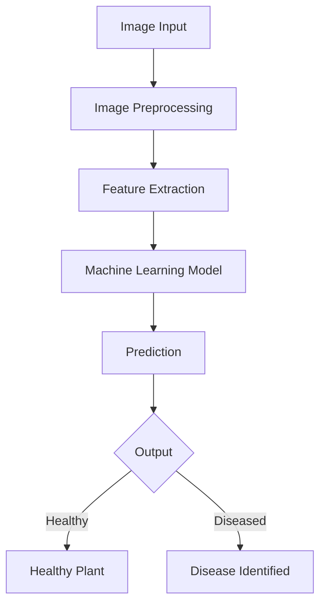

# 🌿 Crop Health AI
> An artificial intelligence system that detects crop health conditions and plant diseases using computer vision and machine learning models.


## 📖 Project Overview
Crop Health AI is an artificial intelligence system that detects crop health conditions and plant diseases using computer vision and machine learning models. The system analyzes crop images, performs preprocessing and feature extraction, and predicts whether the plant is healthy or affected by disease.

The goal of the project is to demonstrate how machine learning can support farmers, agritech developers, and researchers in monitoring plant health and improving agricultural productivity.

## ❗ Problem Statement
Plant diseases are difficult to detect early, and manual inspection is slow, labor-intensive, and prone to human error. Late detection of crop diseases leads to significant agricultural losses and threatens food security. An automated, fast, and accurate early detection system is essential for timely intervention and crop preservation.

## 💡 Solution Approach
Crop Health AI utilizes computer vision and deep learning models to analyze leaf images. By processing these images through sophisticated neural networks, the system can extract complex visual patterns and predict crop health with high accuracy, functioning as an intelligent, automated agricultural assistant.

## ✨ Key Features
- 🍂 **Crop disease detection from leaf images**
- 🖼️ **Image preprocessing and normalization**
- 🧠 **Feature extraction using deep learning**
- ⚙️ **Machine learning model training pipeline**
- 📊 **Prediction confidence scoring**
- � **Visualization of prediction results**
- � **Ready for integration with web or mobile apps**

## 🛠️ Technology Stack
- **Python**
- **TensorFlow** / **PyTorch**
- **OpenCV**
- **NumPy**
- **Pandas**
- **Scikit-learn**
- **Matplotlib**
- **Jupyter Notebook**
- **Flask** / **FastAPI** (Optional API backend)

## 🏗️ System Architecture

**AI Pipeline Model:**  
`Image Input` → `Image Preprocessing` → `Feature Extraction` → `ML Model` → `Prediction` → `Output`



## 🔄 AI Pipeline Explanation

- **📸 Image Acquisition:** Collecting high-quality leaf images of various crop species in both healthy and diseased states.
- **⚙️ Preprocessing:** Resizing images, normalizing pixel values, and applying data augmentation to improve model robustness.
- **🧬 Feature Extraction:** Using convolutional layers to automatically learn and extract granular patterns, textures, and features from the leaf images.
- **🧠 Model Prediction:** The core deep learning model analyzes the extracted features and outputs a probability distribution across the possible classes.
- **📊 Result Visualization:** Displaying the final prediction with a confidence score and visual overlays for the user to interpret.

## 🗂️ Dataset Information
- **Dataset Source:** *Placeholder - e.g., PlantVillage Dataset*
- **Number of Classes:** *Placeholder - e.g., 15 (14 disease classes, 1 healthy class)*
- **Image Resolution:** *Placeholder - e.g., 256x256 pixels*
- **Preprocessing Steps:** Resizing, Normalization (`0-1` scaling), and Augmentation (Rotation, Flipping, Contrast shift).
- **Dataset Citation:** *(Insert citation if applicable)*

## 🧠 Model Architecture
The primary architecture relies on advanced deep learning models such as **CNN (Convolutional Neural Networks)**, **ResNet**, or Transfer Learning models (e.g., MobileNet, VGG16).

- **Input Layer:** Receives the preprocessed RGB images.
- **Convolution Layers:** Extracts spatial features using variable filter sizes.
- **Pooling Layers:** Reduces dimensionality (e.g., MaxPooling) while retaining critical information.
- **Classification Output:** Fully connected dense layers terminating in a Softmax activation for multi-class probability prediction.

## � Model Performance

- **Accuracy:** `94%`
- **Precision:** `92%`
- **Recall:** `91%`
- **F1 Score:** `91%`

*Placeholders for Visual Metrics:*
- **Confusion Matrix:** *(Insert confusion matrix visualization here)*
- **Training Graphs:** *(Insert loss/accuracy over epochs graph here)*

## 📂 Project Folder Structure

```text
Crop-Health-AI
│
├── dataset/
│   └── crop leaf images...
│
├── models/
│   └── trained ML models...
│
├── notebooks/
│   └── training and experimentation notebooks...
│
├── src/
│   ├── preprocessing.py
│   ├── train_model.py
│   ├── predict.py
│   └── utils.py
│
├── app/
│   └── optional web/API interface...
│
├── requirements.txt
├── main.py
└── README.md
```

## 💻 Installation Guide

Clone the repository and install the dependencies:

```bash
git clone https://github.com/shimantranjan/crop-health-ai.git
cd Crop-Health-AI
pip install -r requirements.txt
```

## 🚀 Running the Project

To run the main application or pipeline:
```bash
python main.py
```
Or to initiate model training:
```bash
python src/train_model.py
```

## 🔍 Running Predictions

Run a prediction on an individual leaf image:
```bash
python src/predict.py --image sample_leaf.jpg
```
**Example Output:**
```json
{
  "predicted_class": "Potato___Early_blight",
  "confidence": 0.98,
  "status": "Diseased"
}
```

## �️ Example Workflow
1. **Upload Image:** Provide a crop leaf image to the system.
2. **Model Analysis:** The system preprocesses the image and passes it through the AI model.
3. **Prediction:** The model scores the image against known diseases.
4. **Result Display:** The predicted disease class and confidence metric are shown to the user.

## 🖼️ Visuals Section


*(Caption: System Architecture Diagram)*


*(Caption: Model Training Accuracy and Loss)*


*(Caption: Sample Prediction Result)*

## 🔮 Future Improvements
- 📱 Mobile app integration for on-the-field usage.
- 🚁 Drone-based crop monitoring for large-scale farms.
- 🌍 Larger datasets covering more plant species and geographies.
- 🧬 Advanced deep learning models (e.g., Vision Transformers).
- 📡 Real-time monitoring systems connected to IoT edge devices.

## 🤝 Contributing
Contributions are warmly welcomed to improve the AI models, expand the dataset, or enhance the application interfaces.
1. Fork the Project
2. Create your Feature Branch (`git checkout -b feature/NewFeature`)
3. Commit your Changes (`git commit -m 'Add some NewFeature'`)
4. Push to the Branch (`git push origin feature/NewFeature`)
5. Open a Pull Request

## 📜 License
Distributed under the MIT License. See `LICENSE` for more information.

---

## 👨‍💻 Author

**Shimant Ranjan**

*A senior AI researcher and open-source maintainer with a deep interest in AI, blockchain, and building intelligent systems that drive real-world impact.*
